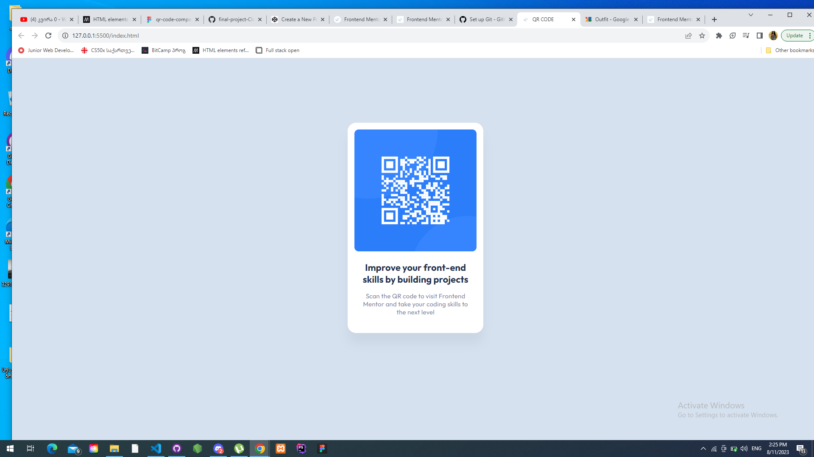

# QR-code-challenge
# QR-code-challenge

# Frontend Mentor - QR code component solution

This is a solution to the [QR code component challenge on Frontend Mentor](https://www.frontendmentor.io/challenges/qr-code-component-iux_sIO_H). 

## Table of contents

- [My process]
  - [What I learned] inline styles 
  - [Useful resources] https://docs.github.com/en/get-started/quickstart/set-up-git
- [Author] Ninaniel

## Overview
this is only begining

### Screenshot

### What I learned

Adding fonts to the project;
margin and padding 

